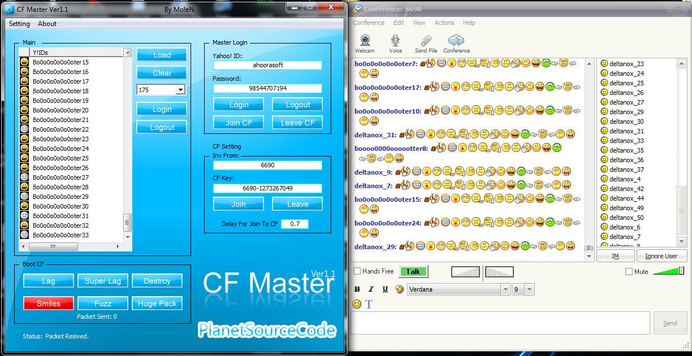



## Yahoo\! CF\(ConFerence\) Master Ver1\.1

### Description

hi guys

this is a Yahoo! tools

First Load uoir bot ids

than login all of them

then login your Master ID(Up-Right part of Program)

Then Just Send Invite from Yahoo!ID(which is in Conference) Conferenc will Come to Program! and then click join! you will see Bot IDs Join CF 1BY1

Then you can lag cf with Boot CF option ;)

Enjoy!
 
### More Info
 

             |
---                |---
**Submitted On**   |2010-02-06 01:42:14
**By**             |[ic0der](https://github.com/Planet-Source-Code/PSCIndex/blob/master/ByAuthor/ic0der.md)
**Level**          |Advanced
**User Rating**    |5.0 (10 globes from 2 users)
**Compatibility**  |VB 6\.0
**Category**       |[Internet/ HTML](https://github.com/Planet-Source-Code/PSCIndex/blob/master/ByCategory/internet-html__1-34.md)
**World**          |[Visual Basic](https://github.com/Planet-Source-Code/PSCIndex/blob/master/ByWorld/visual-basic.md)
**Archive File**   |[Yahoo\!\_CF\(218041572010\.zip](https://github.com/Planet-Source-Code/ic0der-yahoo-cf-conference-master-ver1-1__1-73122/archive/master.zip)

